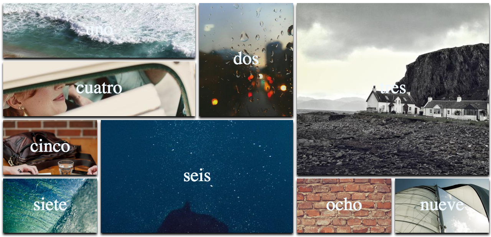

# Mosáico de imágenes con grid
Probando grid, se me ocurrió la idea de crear un mosaico de imágenes, las cuales tienen una animacion al pasar el raton sobre ellas con hover. Me gustaría haber añadido una animación en lugar de un :hover, pero hasta que no demos javascript tovadía no puedo.
Estoy muy contento de como ha quedado, y pienso que el grid tiene un gran potencial que hay que explotar al máximo.
## Screenshot y video

